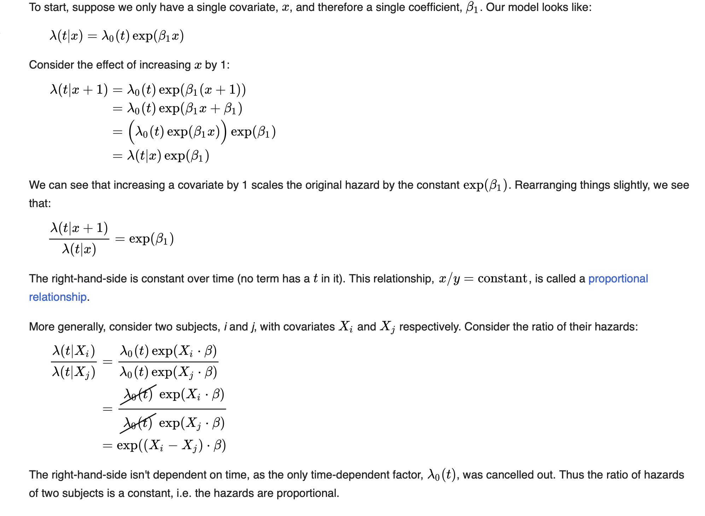

# SurvivalMeetsFin

> **Educational research tool** — applies survival analysis to market
> drawdown dynamics. Not financial advice. See [DISCLAIMER.md](DISCLAIMER.md).

## What it does

SurvivalMeetsFin fits time-to-event models on non-overlapping peak-to-trough
price episodes and asks: *given today's risk environment, how long is the
asset likely to survive without breaching a 5% drawdown threshold?*

**Models fitted**
- Cox Proportional Hazards (Efron ties, hand-rolled BFGS + analytical gradient)
- Weibull, Log-Normal, Log-Logistic AFT (AIC/BIC comparison)
- Harrell C-index, pairwise and 3-group log-rank tests

**Covariates**
- `log(risk)` — log level of the risk indicator (e.g. VIX), lagged 1 day
- `risk_chg5` — 5-day % change in risk, lagged 1 day
- `asset_vol` — 21-day annualised realised volatility
- `vol_spread` — implied-minus-realised vol spread (auto-scaled)
- `momentum` — 20-day cumulative log return, lagged 1 day
- `regime` — Low / Mid / High bucketing of the risk indicator

## Quick start

```bash
git clone https://github.com/<you>/SurvivalMeetsFin.git
cd SurvivalMeetsFin
pip install -r requirements.txt
python run.py
# open http://localhost:5050
```

## Project layout

```
SurvivalMeetsFin/
├── run.py
├── requirements.txt
├── DISCLAIMER.md
├── LICENSE
├── survival/
│   ├── config.py       all tunable constants
│   ├── data.py         data download & feature engineering
│   ├── episodes.py     peak-to-trough episode construction
│   ├── cox.py          Cox PH (Efron ties, BFGS)
│   ├── aft.py          Weibull / LogNormal / LogLogistic AFT
│   ├── logrank.py      pairwise & 3-group log-rank tests
│   └── scoring.py      live covariate construction & prediction
└── server/
    ├── app.py          Flask application factory
    ├── state.py        shared state & threading primitives
    ├── routes.py       API endpoints (/api/signal, /api/stream, /api/config)
    ├── worker.py       background refresh thread
    └── dashboard.py    self-contained HTML/CSS/JS dashboard
```

## Configuration

All model parameters live in `survival/config.py`.

| Constant | Default | Meaning |
|---|---|---|
| `DD_THR` | `-0.05` | Drawdown event threshold |
| `VOL_WIN` | `21` | Realised-vol rolling window (days) |
| `MOM_WIN` | `20` | Momentum rolling window (days) |
| `RISK_LOW` | `15` | Low/Mid regime boundary |
| `RISK_HIGH` | `25` | Mid/High regime boundary |
| `REFRESH_S` | `60` | Live-scoring interval (seconds) |

## License

MIT — see [LICENSE](LICENSE).

---

> **Disclaimer:** For educational and research purposes only.
> Not financial advice. See [DISCLAIMER.md](DISCLAIMER.md).
